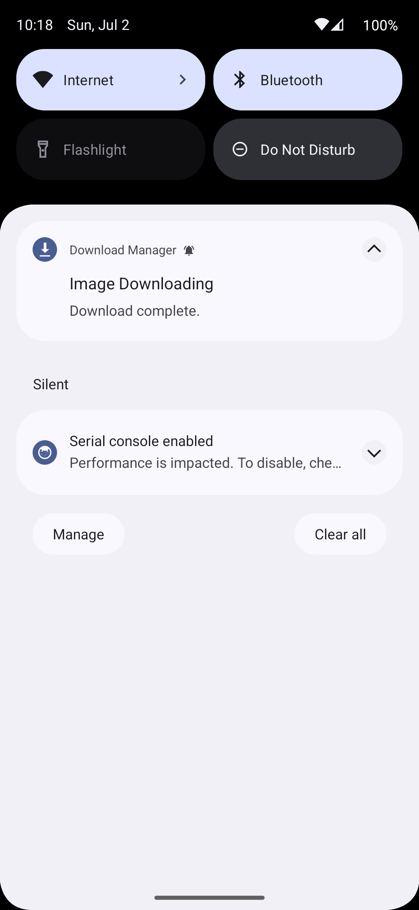

# Android Image Search App using Pixabay API: PixaBayImageSearch

## Description

The Android Image Search App is a mobile application that allows users to search for images using the Pixabay Image Search API. The app is built using Jetpack Compose, Pixabay Image Search API, Retrofit, Hilt, Unit Testing, Navigation Component, Clean Architecture, and HTTP caching.

## Features

- **Image Search**: Users can enter a search query in the app's search bar and retrieve a list of relevant images from the Pixabay Image Search API.
- **Image Details**: When a user clicks on an image from the search results, they can view additional details about the image, such as the image's author, tags, and image dimensions.
- **Image Downloading**:

## Screenshots

  
  
   

  <em>Screenshot 1: Image Search Screen</em>
   
  <em>Screenshot 2: Image Details Screen</em>
    
  <em>Screenshot 2: Download Notificationn</em>

## Functionality

The Android Image Search App provides the following functionality:

1. The user launches the app and is presented with the image search screen.
2. The user can enter a search query in the search bar.
3. When user a image query a beautiful placeholder composable with animation is shown.
4. The app retrieves a list of images from the Pixabay Image Search API based on the user's query.
5. The app displays the retrieved images in a grid layout on the image search screen.
6. The user can click on an image to view additional details about the selected image.
7. The app navigates to the image details screen and displays the image's author, tags, and dimensions.
8. User Can download the image while clicking on download button
9. The user can go back to the image search screen to perform another search or view different images.

## Testing
UI test cases

## Technologies Used

The Android Image Search App is built using the following technologies:

- Jetpack Compose
- Pixabay Image Search API
- Retrofit
- Hilt
- Unit Testing
- Navigation Component
- Clean Architecture
- HTTP Caching
- Coil
- Download Manager
- Mockito
- Jnuit4

## Setup and Configuration

To run the Android Image Search App on your local machine, follow these steps:

1. Clone the repository: `git clone https://github.com/manishkaushik900/PixaBayImageSearch.git`
2. Open the project in Android Studio.
3. Build and run the app on an emulator or physical device.

## Testing

The Android Image Search App includes unit tests to ensure the correctness of its components. To run the tests, follow these steps:

1. Open the project in Android Studio.
2. Right-click on the `test` folder.
3. Select "Run Tests" to execute the unit tests.

## Contributions

Contributions to the Android Image Search App are welcome. If you have any ideas, bug fixes, or improvements, feel free to submit a pull request.

